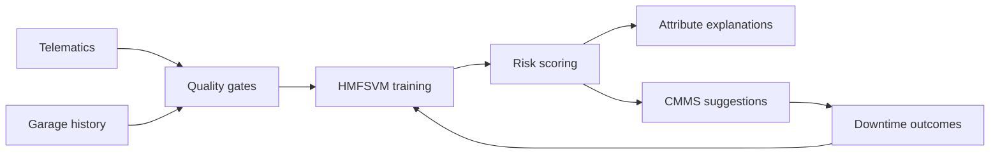

# FleetMend

**Source:** `ai-in-iot/1806.09612/`
**Domain:** `ai-iot`
**One-liner:** A predictive maintenance service for industrial IoT vehicle fleets that scores repair probability from telematics and garage history using hierarchical modified fuzzy SVMs, so operators schedule work before SLA-breaking downtime.
**Wedge:** Telecom and field-service fleets with multi-garage telematics (mileage, age, make/model, past repairs) still running calendar-based preventive maintenance.
**Positioning:** Hierarchy-aware fuzzy SVM maintenance for connected fleets. Only about 10% of IoT-generated data is used for deeper analysis; checklist PM still burns labor without preventing failure. FleetMend productizes HMFSVM — fuzzy membership in kernel space, hierarchical refinement, imbalance-aware costs — reporting ~96% accuracy and AUC ~0.966 on the paper’s garage data versus weaker logistic/RF/SVM baselines.

## Market research synthesis

### Thesis from source

Connected vehicle fleets in industrial IoT generate sensor and telematics streams (temperature, infrared, acoustic, vibration, battery, sound) while customers demand higher uptime and aggressive SLAs. Traditional preventive maintenance sends technicians on fixed schedules with high cost and little assurance. Predictive maintenance promises scheduled corrective work, fewer unplanned stops, optimized parts, and compliance reporting — but organizations struggle to turn sensor amassing into timely insight.

The source works a concrete garage problem for a telecom-based company across five garages (14 months of data in one garage with 3923 records / 2097 used; 24 months and 890665 records / 11456 used in others after cleaning invalid rows and sparse repair types). Class imbalance and population drift are first-class: majority under-sampling balances training; models are fit on narrow time windows. Hierarchical Modified Fuzzy SVM (HMFSVM) extends fuzzy SVM ideas (membership from class center/radius in feature space) into a hierarchy that improves sensitivity to imbalance, reduces support vectors, cuts training time, and improves generalization. Reported results: AUC about 0.966 and accuracy about 96%; sensitivity/specificity/accuracy for HMFSVM at 95.66% / 96.64% / (table leads logistic 66.86%, RF 70.86%, SVM 80.69%, FSVM 86.96%, MFSVM 90.86%). Inputs include make, model, age, distance travelled, past maintenance; output is probability of needing maintenance or repair in a horizon.

### Buyer & economic model

- **Primary buyer:** VP of Fleet Operations or Head of Field Service at telecom, utilities, and logistics fleets.
- **Users:** garage planners, dispatchers, telematics analysts, parts planners, SLA managers.
- **Budget owner / value metric:** maintenance and downtime budget. Value metrics: unplanned downtime hours, garage visits avoided, SLA breach rate, parts inventory turns, leasing availability.
- **Competing status quo:** calendar PM checklists; threshold alarms on single sensors; generic AutoML on telematics without imbalance/hierarchy handling.

### Domain constraints

- **Regulatory / trust / safety:** missed predictions on safety-critical failures are liability events; over-prediction wastes leased vehicle availability.
- **Data sensitivity:** telematics and driver-linked scores (when present) are personal/operationally sensitive; the paper omitted fuel-economy and driver-behavior scores when incomplete across garages.
- **Change-management realities:** garages distrust black-box scores; planners need explainable drivers (age, mileage, repair history) and gradual dual-run with PM schedules.

## Business requirements

- BR-1: Each vehicle must receive a time-bounded probability of requiring maintenance or repair, with a chosen horizon configurable per fleet.
- BR-2: Models must handle class imbalance explicitly; promotion requires sensitivity and specificity both above agreed floors on garage-held-out data.
- BR-3: Training windows must be narrow enough to limit population drift, with documented window policy per garage.
- BR-4: Inputs must support make, model, age, distance, and past maintenance history; sparse repair-type features must be excludable without breaking scoring.
- BR-5: Predictions must feed work-order suggestions into the CMMS without auto-closing tickets unless policy allows.
- BR-6: Planners must see top contributing attributes for each high-risk score for garage acceptance.
- BR-7: Multi-garage deployments must allow per-garage models or hierarchical transfer with explicit promotion.
- BR-8: Data quality gates must drop null/out-of-range rows and report exclusion rates before training.
- BR-9: Dual-run against calendar PM must report downtime and visit deltas for at least one planning cycle before cutover.
- BR-10: Audit export must tie scored probabilities to scheduled and completed work orders for SLA reporting.
- BR-11: Commercial packaging prices by active vehicles and garages, not by raw telematics gigabytes alone.
- BR-12: Driver-behavior and fuel-economy features, if used, require separate consent and completeness thresholds.

## User stories

Canonical user stories live in sibling [USER_STORIES.md](USER_STORIES.md).

## System design

### Overview

FleetMend ingests telematics and garage history, cleans and balances datasets, trains hierarchical modified fuzzy SVM models per garage or hierarchy, scores vehicles for maintenance probability, explains top drivers, and pushes suggested work into CMMS while measuring downtime outcomes.

### Actors & boundaries

- **Actors:** planners, dispatchers, parts planners, fleet ops, analysts, SLA managers, vehicle telematics gateways.
- **Trust boundary:** telematics and garage systems of record remain authoritative; FleetMend is advisory unless CMMS auto-create is enabled. Driver-linked features are isolated behind consent flags.
- **Human-in-the-loop points:** work-order acceptance, model promotion, feature consent, dual-run cutover.

### Core capabilities

1. **Fleet and garage onboarding** — vehicle master and garage scopes.
2. **Telematics and history intake** — cleaning and quality gates.
3. **Imbalance-aware HMFSVM training** — hierarchical fuzzy SVM with cost ratios.
4. **Risk scoring** — horizon probabilities per vehicle.
5. **Explanation** — top contributing attributes.
6. **CMMS suggestions** — work-order candidates.
7. **Dual-run analytics** — PM versus predictive outcomes.
8. **Audit and SLA reporting** — score-to-work provenance.

### Conceptual data

- **Primary entities:** Fleet, Garage, Vehicle, TelematicsSnapshot, RepairHistory, TrainingWindow, MendModel, RiskScore, WorkSuggestion, OutcomeReport.
- **Critical events:** data quality gate failed, model trained, score published, work suggested/accepted, downtime event recorded, drift threshold breached.
- **Retention / audit needs:** scores and work links retained for SLA and warranty windows; raw telematics retained per policy with minimization.

### Integrations (conceptual)

- **Systems of record:** telematics platforms, CMMS/EAM, lease/availability systems.
- **Upstream signals:** OBD/IoT sensors, garage DMS, parts inventory.
- **Downstream actions:** work-order create, dispatch constraints, parts reservations, SLA dashboards.

### High-level architecture

### Success metrics

- **Leading:** sensitivity/specificity on held-out garage weeks; % high-risk vehicles pulled before failure; dual-run visit reduction.
- **Lagging:** unplanned downtime hours, SLA breaches, maintenance cost per vehicle, lease availability.

## OpenAPI skeleton

Canonical HTTP surface lives in sibling `openapi.yaml`. Summarize here:

- **Base path:** `/v1/...`
- **Auth:** API key and/or Bearer JWT (operator)
- **Resource groups:** Fleets, Vehicles, Models, RiskScores, WorkSuggestions
