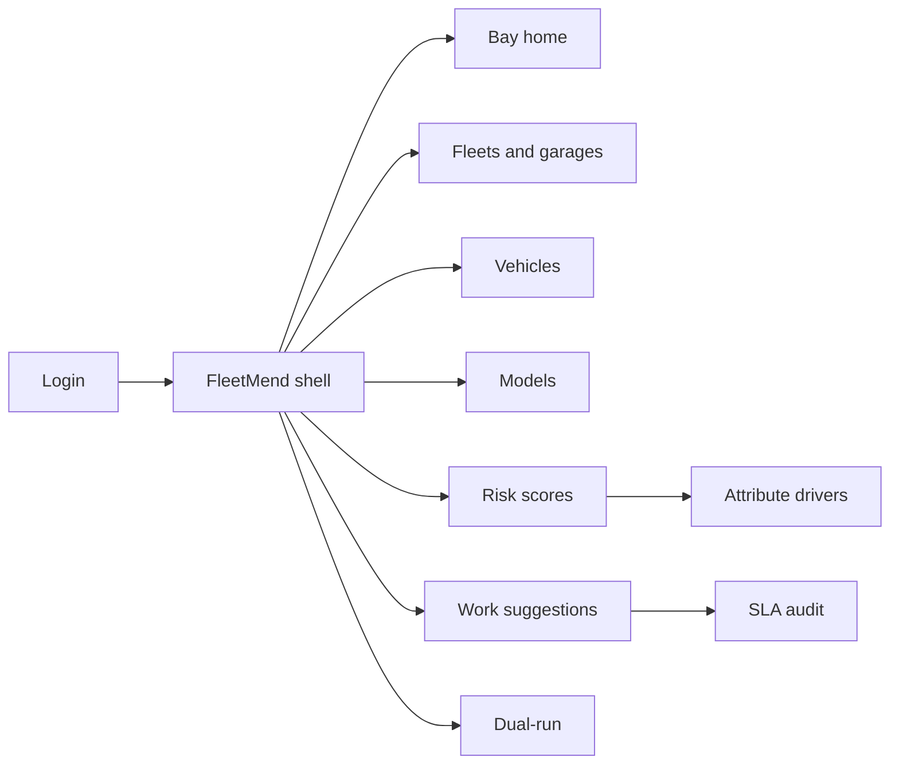
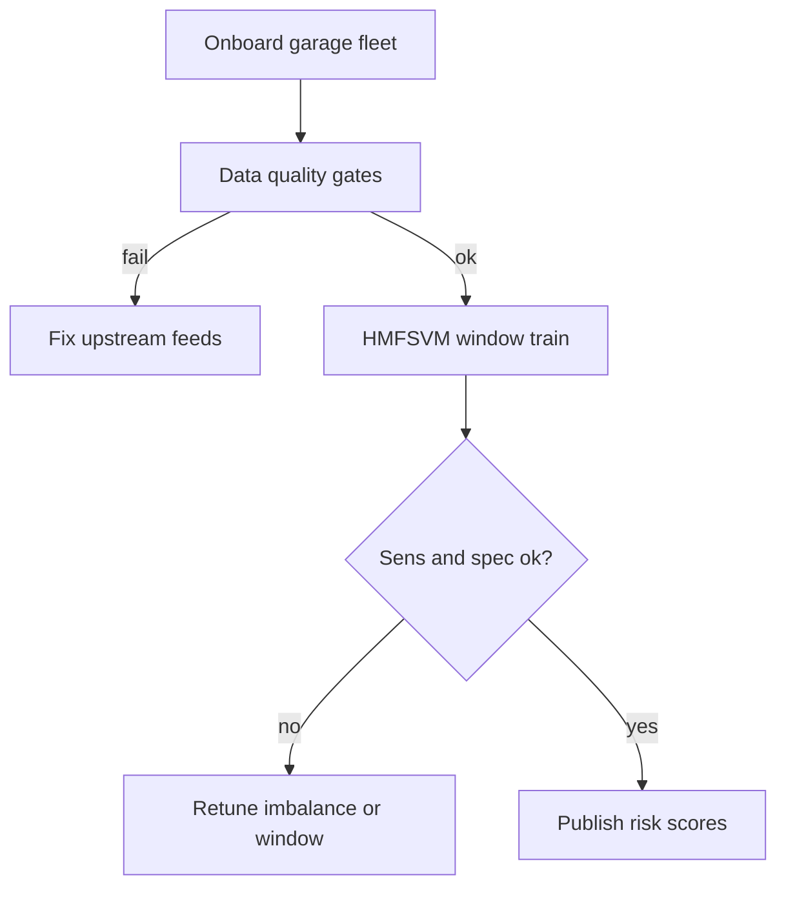
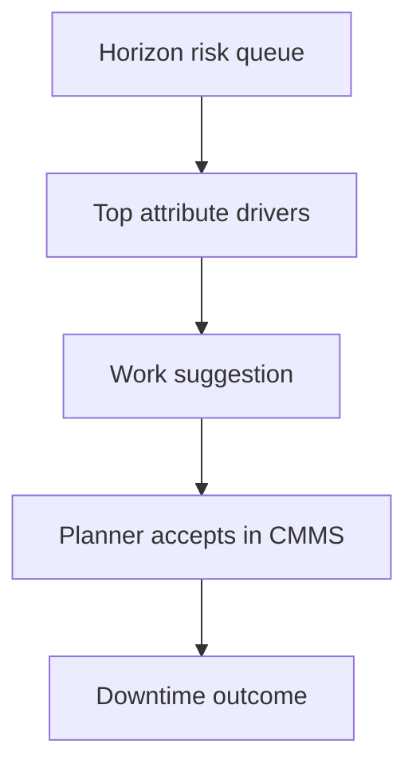

# FleetMend — Web app

**Product:** [PRODUCT.md](./PRODUCT.md)
**Primary surface:** Predictive fleet maintenance console (garage planning + fleet ops under one FleetMend shell)
**Secondary surfaces:** Dual-run PM vs predictive outcome report; SLA score-to-work audit export
**Design thesis:** FleetMend is a garage triage bay for connected fleets — the UI metaphor is pulling the right van before it dies on a customer site, not a calendar PM clipboard or a black-box “AI health” dial. Visual language is industrial bay grey with mend-amber risk ranks and service-teal completed pulls: a high probability with age/mileage/prior-repair drivers feels actionable; a score without explanation feels untrusted. The wordmark sits as a quiet teal seal on every risk queue and work-suggestion screen so planners know whose hierarchical fuzzy-SVM odds they are scheduling against.

## UX research synthesis

### Category peers (best-in-class)

- **Geotab / Samsara maintenance modules:** Telematics-linked service due lists and fault codes in fleet ops. Steal: vehicle-ranked work queues tied to live telematics; reject single-threshold fault lamps as the only predictor — FleetMend’s HMFSVM handles imbalance and hierarchy (BR-2, BR-7).
- **IBM Maximo / UpKeep CMMS:** Work-order lifecycle, parts staging, planner acceptance. Steal: suggestions into CMMS without auto-close by default (BR-5); reject forcing ticket spam from every score tick.
- **Uptake / SparkCognition Fleet AI (industrial PdM):** Risk ranking with downtime KPIs vs preventive baselines. Steal: dual-run vs calendar PM with downtime/visit deltas (BR-9); reject unexplainable deep scores for garage culture (BR-6).
- **Fleetio:** Practical garage planner UX for multi-site fleets. Steal: per-garage scopes and planner-first density; reject consumer “car app” chrome for telecom field fleets.

### Patterns to adopt / reject

- **Adopt:** Horizon-bounded repair probabilities; sensitivity+specificity floors; narrow training windows against drift; make/model/age/distance/history inputs; sparse repair types excludable; top attribute explanations; CMMS suggestions advisory; dual-run before cutover; score↔work audit; driver-behavior features off by default.
- **Reject:** Calendar-only home; purple AI glow; auto-closing tickets; black-box ranks; training on all-time data without windows; pricing by raw telematics GB; HR-surveillance driver scores as default.

### Trust, density, and workflow constraints from PRODUCT.md

Missed safety-critical failures are liability; over-prediction wastes leased availability (domain). Garages distrust black boxes — need explainable drivers and dual-run (change-management). Driver-behavior/fuel features need consent and completeness (BR-12). Multi-garage models or hierarchical transfer with explicit promotion (BR-7). Data quality gates report exclusion rates (BR-8).

## Information architecture

### Nav model

### Roles → default home

| Role | Default home | Why |
|------|--------------|-----|
| Garage planner | Risk scores — this week | Pull before failure (BR-1) |
| Dispatcher | Vehicles / assignment risk | Avoid high-risk on long jobs |
| Parts planner | Work suggestions aggregate | Stage parts (repair-class rollup) |
| Fleet operations manager | Bay home + dual-run | Downtime vs PM (BR-9) |
| Telematics analyst | Models — imbalance/drift | Retrain windows (BR-3, BR-8) |
| SLA / compliance | SLA audit export | Score-to-work proof (BR-10, BR-12) |

### Cross-links to OpenAPI resources

| Nav area | OpenAPI tags / resources |
|----------|---------------------------|
| Fleet / garage scopes | Fleets |
| Vehicle master | Vehicles |
| HMFSVM versions | Models |
| Horizon probabilities | RiskScores |
| CMMS candidates | WorkSuggestions |

## Screen inventory

### Bay home

- **Purpose:** Answer “which vehicles will break our SLA this horizon, and is predictive beating calendar PM?” in one composition.
- **Entry:** Fleet ops default; deep link from SLA risk.
- **Layout regions:** Brand chrome; KPI strip (unplanned downtime hours, high-risk not-yet-pulled, dual-run visit delta, sensitivity/specificity health, leased availability impact); garage heat list; alerts (drift, data quality, consent).
- **Primary actions:** Open risk queue; open dual-run; open garage model health.
- **Empty / loading / error:** Empty = onboard fleet + telematics; error = retry with request id.
- **BR / story ties:** BR-9, BR-11; fleet ops stories.

### Fleets and garages

- **Purpose:** Multi-garage onboarding; per-garage vs hierarchical transfer promotion.
- **Entry:** Fleets nav.
- **Layout regions:** Fleet tree → garages; model binding (local / hierarchical); vehicle counts; window policy summary.
- **Primary actions:** Add garage; promote hierarchical transfer; set horizon default.
- **Empty / loading / error:** Cross-garage poison warning if one site health bad (ops story).
- **BR / story ties:** BR-7, BR-3.

### Vehicles

- **Purpose:** Master list with make/model/age/distance/history; dispatcher risk badge for assignments.
- **Entry:** Vehicles nav; dispatcher path.
- **Layout regions:** Vehicle table (garage, horizon risk, last service, availability); detail with history; exclude sparse repair types from features.
- **Primary actions:** Open score; constrain dispatch; open suggestion.
- **Empty / loading / error:** Incomplete master data = quality gate link.
- **BR / story ties:** BR-4; dispatcher story.

### Models (HMFSVM)

- **Purpose:** Imbalance-aware hierarchical fuzzy SVM training on narrow windows; gate on sensitivity and specificity floors.
- **Entry:** Models nav; analyst default.
- **Layout regions:** Model list (garage, window, AUC/accuracy, sens/spec vs floors, imbalance method); drift report; quality exclusion rate; promote/rollback.
- **Primary actions:** Train window; promote if floors met; disable driver-behavior features (default off).
- **Empty / loading / error:** Promote blocked if sens or spec under floor (BR-2); high exclusion rate = fix feeds first (BR-8).
- **BR / story ties:** BR-2, BR-3, BR-8, BR-12; analyst stories.

### Risk scores

- **Purpose:** Time-bounded probability of needing maintenance/repair; ranked planner queue.
- **Entry:** Planner default; Risks nav.
- **Layout regions:** Ranked list for horizon (this week / configurable); probability; top drivers (age, mileage, prior repair); pull status.
- **Primary actions:** Create work suggestion; snooze with reason; open explanation.
- **Empty / loading / error:** Empty = no vehicles above threshold (healthy), not blank void.
- **BR / story ties:** BR-1, BR-6; garage planner stories.

### Attribute explanation

- **Purpose:** Plain-language top contributing attributes so garage accepts the queue.
- **Entry:** From risk row → Explain.
- **Layout regions:** Driver bars (age, distance, make/model priors, past maintenance); what-is-not-used callout (e.g., driver behavior off); confidence notes.
- **Primary actions:** Accept into work suggestion; challenge score (feedback).
- **Empty / loading / error:** Missing drivers = do not show naked score alone.
- **BR / story ties:** BR-6; change-management trust.

### Work suggestions

- **Purpose:** Feed CMMS candidates without auto-closing unless policy allows; parts aggregate view.
- **Entry:** Work nav; parts planner secondary.
- **Layout regions:** Suggestion queue (vehicle, reason, parts hint); CMMS sync status; auto-create policy flag (default off); accepted/rejected.
- **Primary actions:** Push to CMMS; accept/reject; parts rollup export.
- **Empty / loading / error:** CMMS down = queue locally with banner.
- **BR / story ties:** BR-5; parts planner story.

### Dual-run analytics

- **Purpose:** Compare predictive vs calendar PM on downtime and garage visits for ≥ one planning cycle before cutover.
- **Entry:** Dual-run nav; ops manager path.
- **Layout regions:** Side-by-side KPIs; visit deltas; SLA breaches; cutover gate.
- **Primary actions:** Hold dual-run; approve cutover; export finance pack.
- **Empty / loading / error:** Cycle incomplete = cutover locked (BR-9).
- **BR / story ties:** BR-9; fleet ops defend-to-finance story.

### SLA audit export

- **Purpose:** Tie scored probabilities to scheduled and completed work orders for customer uptime reports.
- **Entry:** Audit from Work/home; SLA manager default secondary.
- **Layout regions:** Period builder; score→WO→completion chain; download.
- **Primary actions:** Generate; download; mark submitted.
- **Empty / loading / error:** Orphan scores without WO link highlighted.
- **BR / story ties:** BR-10.

### Consent & sensitive features

- **Purpose:** Driver-behavior and fuel-economy features require separate consent and completeness thresholds; default off.
- **Entry:** Fleet settings / compliance.
- **Layout regions:** Feature toggles; completeness meters; consent registry; HR-surveillance warning copy.
- **Primary actions:** Enable only if consent+completeness; disable fleet-wide.
- **Empty / loading / error:** Incomplete consent = features forced off.
- **BR / story ties:** BR-12; compliance officer story.

## Key flows

1. **Stand up a garage model** — onboard fleet → quality gates → narrow window train → sens/spec floors → publish scores; failure: high exclusions or floors unmet.

2. **Planner pull before failure** — ranked risks → read drivers → suggest work → CMMS accept → completion feeds outcomes (BR-1, BR-5, BR-6).

3. **Dual-run cutover** — run alongside calendar PM one cycle → compare downtime/visits → cut over or hold (BR-9).

4. **Hierarchical transfer** — promote donor garage model to peer with explicit approval (BR-7).

5. **SLA pack** — export score→work→completion for customer reporting (BR-10).

## Design system

### Tokens (CSS variables)

- `--color-ink: #ECEFF1` — primary text
- `--color-bay-950: #121416` — app ground
- `--color-bay-900: #1C1F24` — panels
- `--color-bay-700: #3A4048` — rules
- `--color-mend: #E6A23C` — elevated risk / due pull
- `--color-mend-dim: #8A6420` — mend on dark
- `--color-service: #3DB8A0` — completed pull / dual-run win
- `--color-coral: #E85D4C` — SLA breach / safety miss risk
- `--color-steel: #9AA3AD` — secondary labels
- `--color-brand: #7ED4C0` — FleetMend wordmark
- `--font-display: "Barlow Condensed", sans-serif` — bay ranks and KPIs
- `--font-body: "Source Sans 3", sans-serif`
- `--font-mono: "IBM Plex Mono", monospace` — VINs, WO ids, model versions
- `--space-1`…`--space-8`: 4px scale
- `--radius-sm: 4px`; `--radius-md: 8px`
- `--motion-rank: 180ms ease-out` — risk row promote in queue
- `--motion-pull: 220ms ease-in-out` — suggestion accept
- `--motion-drift: 300ms linear` — drift warning
- Atmosphere: subtle concrete/bay floor noise in bay-900; no stock smiling-technician heroes; no purple “AI fleet” gradients.

### Typography & brand

- Condensed display for probability ranks; body for planner explanations; mono for VIN/WO.
- Brand on risk and work screens; login: “Pull the van before the SLA.”

### Do / don’t

- **Do:** Explain every high score; advisory CMMS by default; dual-run before cutover; narrow windows; driver features off.
- **Don’t:** Purple AI glow; naked probabilities; auto-close tickets; calendar-only home; train without quality gates; HR driver surveillance by default.

### Accessibility & domain trust cues

- AA+ on mend/service/coral; risk levels also text (“High / 7-day horizon”).
- Live regions for new high-risk vehicles and SLA breaches.
- Focus: fleets → models → risks → explanations → work → dual-run/audit.

## Component patterns

- **HorizonRiskQueue** — ranked vehicles for configurable horizon.
- **AttributeDriverBars** — age / mileage / prior repair contributions.
- **SensSpecFloorGate** — blocks promote when either floor fails.
- **TrainingWindowPolicy** — narrow window per garage with drift badge.
- **WorkSuggestionRow** — CMMS candidate, auto-create off by default.
- **DualRunCompare** — PM vs predictive downtime and visits.
- **ScoreToWorkAudit** — probability → WO → completion chain.
- **DataExclusionMeter** — quality gate exclusion rate.
- **DriverFeatureConsent** — off-by-default sensitive inputs.
- **GarageModelHealth** — per-site sens/spec and poison warning.

## Out of scope for v1 web

- Full CMMS replacement; driver scorecards / HR performance product; consumer passenger-car apps; real-time crash ADAS; parts marketplace; raw video dashcam analytics as primary signal.
